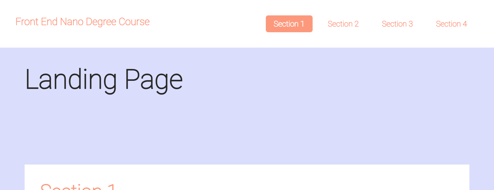
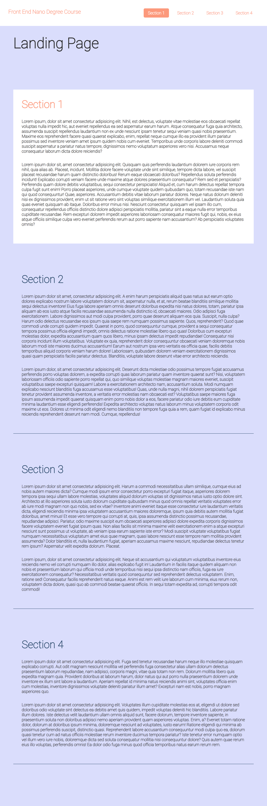

# Front End Web Development Professional 
## Table of content 
  - [Project Name](#project-name)
  - [Author](#author)
  - [Demo](#demo)
  - [Project structure](#project-structure)

-----------------------

### Project Name :

[ &UpArrow; Back to top](#table-of-content)
> ### Landing Page

-----------------------

### Author

[ &UpArrow; Back to top](#table-of-content)
> Mohamed Kamal <mkamalchemist@gmail.com>

-----------------

### DEMO

[ &UpArrow; Back to top](#table-of-content)






-----------------

### Project structure

[ &UpArrow; Back to top](#table-of-content)
```
- Project
  - js /
    - app.js
  - css /
    - styles.css
  - index.html
  - README.md
```

